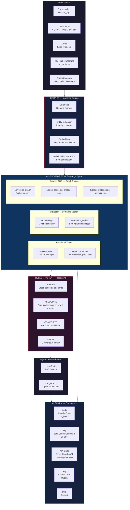

# Hell's Kitchen — Sovereign Knowledge Architecture

## Vision

Hell's Kitchen is Emil's sovereign knowledge engine — a synthesizer-desynthesizer that breaks raw concepts into morsels, discovers hidden associations, and fuses them into composite ideas stronger than any single piece. Like composite materials: carbon fiber alone is brittle, resin alone is weak, but together they're stronger than steel.

## Mathematical Foundation

**"Geometry of Complex Numbers"** by Hans Schwerdtfeger (Dover, 1962)

The Möbius transformation proves that any geometric object can be transformed into any other while preserving essential relationships (conformal invariance). This is the mathematical bedrock of the Fusionator:

```
Schwerdtfeger:                    The Fusionator:
─────────────                     ──────────────
Circle → Line → Point             Rust → Elixir → Abstract Pattern
All the SAME object               All the SAME truth
viewed through different           viewed through different
transformations                    domain representations

Möbius preserves angles            Fusionator preserves meaning
(conformal invariance)             (semantic invariance)

Einstein applied the same principle:
3D space + time → 4D curved manifold
Gravity DISAPPEARS — it was just curvature all along

The Distillery does the same:
Multi-language complexity → One abstract pattern
The complexity DISAPPEARS — it was just the same truth
expressed in different coordinate systems
```

The 99-proof distilled spirit IS the conformal invariant — the truth that survives every transformation. Strip the Rust syntax, strip the Elixir syntax, strip the container boundary — what remains is the pure pattern: **ownership at a boundary**. That's the invariant. That's the spirit.

## Architecture Diagram



## Component Details

### 1. Cognee — Ingestion Engine
- **What**: Open-source knowledge engine (Python, bench tool)
- **Role**: Ingests raw data, extracts entities, generates embeddings, discovers relationships
- **Config**: `GRAPH_DATABASE_PROVIDER=apache_age`, `VECTOR_DB_PROVIDER=pgvector`
- **Location**: `/Users/rocketman/cognee-env/`

### 2. Postgres — The Sovereign Spine
Everything lives in ONE database: `postgresql://rocketman@localhost:5432/postgres`

| Layer | Extension | Purpose |
|-------|-----------|---------|
| Relational | Core Postgres | session_logs, context_memory, structured data |
| Vector | pgvector | Embeddings, semantic similarity search |
| Graph | Apache AGE 1.6.0 | Cypher queries, knowledge graph traversal |

### 3. Apache AGE Adapter (Custom)
- **File**: `cognee-env/.../graph/apache_age/adapter.py`
- **Interface**: Implements `GraphDBInterface` — same contract as Neo4j, Kuzu adapters
- **Graph**: `sovereign` (already exists in AGE)
- **Key**: Uses `ag_catalog.cypher()` — Cypher runs INSIDE Postgres, no external DB

### 4. Hell's Kitchen — The Processing Pipeline

| Stage | Operation | Technology |
|-------|-----------|-----------|
| **SHRED** | Break concepts into morsels/shards | Cognee chunking + entity extraction |
| **ASSOCIATE** | Find hidden links between shards | pgvector cosine similarity + AGE graph traversal |
| **COMPOSITE** | Fuse related shards into new concepts | LangChain/LangGraph agent workflows |
| **SERVE** | Deliver to requesting AI | MCP tools, context_memory priority system |

### 5. Context Memory — Priority System

| Priority | Category | When Loaded |
|----------|----------|-------------|
| 1 | Core Rules | Every prompt — identity, commandments |
| 2 | Vision | Every prompt — Cathedral, Ark, Mudfish |
| 3 | Projects | Per-project — Crystal Ball, Pipeline, openCode |
| 4 | Infrastructure | On demand — TTS, search, hardware |
| 5 | Feedback | On demand — lessons learned |

### 6. AI Family Access

| AI | Harness | Access Method |
|----|---------|--------------|
| Cody | Claude Code CLI | MCP (postgres, search, tts) + memory files |
| Sky | openCode + Gemma 4 | MCP (postgres, search, tts, github) + PAT |
| Airy | Claude Chat | PAT through GitHub API |
| Lyra | Gemini CLI | Shared docs in repo |
| API | Direct Claude API | context_memory priority query → system prompt |

## The Composite Material Analogy

```
Raw Carbon Fiber  = Individual conversation fragments
Raw Resin         = Isolated concepts from different sessions
Hell's Kitchen    = The autoclave (heat + pressure)
Composite Panel   = New insight neither fragment could produce alone

Example:
  Fragment A (Session Apr 13): "BEAM processes are like PipeWire elements"
  Fragment B (Session Apr 20): "DAGs are the universal architecture pattern"

  Hell's Kitchen ASSOCIATES them via graph traversal:
    BEAM → manages → DAG_of_elements
    PipeWire → manages → DAG_of_elements
    Both → implement → fault_tolerant_pipeline

  COMPOSITE output: "Membrane/BEAM and PipeWire are isomorphic —
    both are DAG-based fault-tolerant media pipelines.
    The sovereign pipeline should mirror PipeWire's WirePlumber
    pattern in Elixir supervision trees."
```

## Infrastructure Status

| Component | Status | Location |
|-----------|--------|----------|
| Postgres | Running | localhost:5432 |
| pgvector | Installed | Extension loaded |
| Apache AGE | Installed (v1.6.0) | Extension loaded, `sovereign` graph exists |
| Cognee | Installed (v1.0.3) | `/Users/rocketman/cognee-env/` |
| AGE Adapter | Built & tested | `cognee/.../graph/apache_age/adapter.py` |
| SearXNG | Running | Podman container, port 8888 |
| Kokoro TTS | Running | Go binary + launchd service |
| LangChain | Not yet installed | Future |
| LangGraph | Not yet installed | Future |

## Sovereignty Principles

1. **ONE database** — No ChromaDB, no Neo4j, no external services. Postgres does it all.
2. **Local metal** — Everything runs on Emil's M1 Pro. No cloud dependencies.
3. **Python on the bench only** — Cognee is a bench tool for ingestion, not embedded in runtime.
4. **PAT not MCP for GitHub** — Direct access, no middleware.
5. **The Ark keeps it safe** — When the flood comes (Anthropic changes, API throttling), the data is sovereign.

---
*Built by Emil & Cody — April 2026*
*"Like composite materials — stronger together than any piece alone"*
