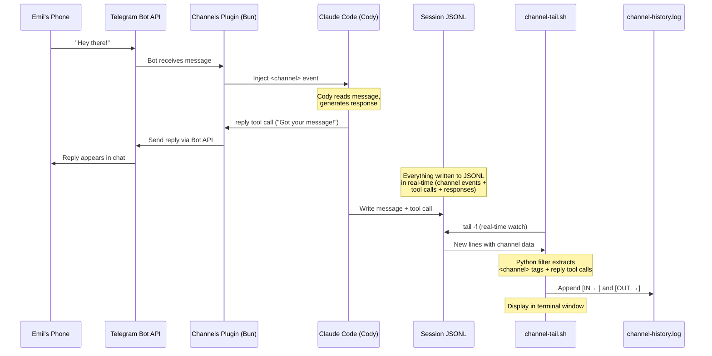

# Claude Code Channels — Setup Guide
## Telegram Channel to Cody
**Date**: 2026-03-21
**Feature**: Claude Code Channels (research preview, v2.1.80+)

---

## What It Does

Channels let external platforms push messages into a running Claude Code session in real-time. You message a Telegram bot from your phone → it arrives in Cody's session → Cody processes it and replies back through Telegram.

**Two-way, real-time communication with Cody from your phone.**

---

## Prerequisites

- Claude Code **v2.1.81** (updated 2026-03-21)
- Claude.ai **Pro or Max** subscription
- **Bun** runtime installed (`brew install oven-sh/bun/bun`) — channels plugins run on Bun
- Telegram bot created via @BotFather

---

## What We Did

### 1. Updated Claude Code
```bash
# Updated npm package
npm install -g @anthropic-ai/claude-code@latest

# Old version was at ~/.local/bin/claude → 2.1.74
# New version at ~/.npm-global/bin/claude → 2.1.81
# Fixed symlink:
ln -sf /Users/rocketman/.npm-global/bin/claude /Users/rocketman/.local/bin/claude

# Verify:
claude --version
# Should show: 2.1.81 (Claude Code)
```

### 2. Installed Bun (REQUIRED — channels won't work without it)
```bash
brew install oven-sh/bun/bun

# Verify:
bun --version
# Should show: 1.3.11 or later
```
**GOTCHA**: Without Bun, channels start silently but the Telegram bot never responds. No error message — it just doesn't work. This was a 30-minute debugging rabbit hole.

### 3. Installed Telegram Plugin
```bash
claude plugin install telegram@claude-plugins-official
```
This added to `~/.claude/settings.json`:
```json
"enabledPlugins": {
    "telegram@claude-plugins-official": true
}
```

### 4. Created Telegram Bot
- Opened @BotFather in Telegram
- Sent `/newbot`
- Name: **Codys Channel**
- Username: **@codys_channel_bot**
- Token saved to: `~/.jarvina/cody-channel-bot-token`
- **GOTCHA**: Searching for the bot in Telegram search may not find new bots right away. Use direct URL: `https://t.me/codys_channel_bot`

### 5. Start Claude Code with Channels
```bash
claude --channels plugin:telegram@claude-plugins-official --dangerously-skip-permissions
```

### 5. Configure Bot Token (inside Claude Code session)
```
/telegram:configure 8788209315:AAENti3BgueFj6ynUAOfeoLDcMkkkQAgelY
```

### 6. Pair Your Telegram Account
- Send any message to @codys_channel_bot on your phone
- You'll receive a pairing code
- In Claude Code, run:
```
/telegram:access pair <code>
```

### 7. Lock Down Access (Security)
```
/telegram:access policy allowlist
```
This ensures only YOUR Telegram account can send messages to Cody.

---

## Daily Usage

### Starting Cody with Channels
```bash
claude --channels plugin:telegram@claude-plugins-official --dangerously-skip-permissions
```

### Or update the cody alias (optional)
Add to `~/.zshrc`:
```bash
alias cody-channels="claude --channels plugin:telegram@claude-plugins-official --dangerously-skip-permissions"
```

### Sending Messages
- Open @codys_channel_bot in Telegram
- Type your message
- It arrives in Cody's terminal session
- Cody replies back through Telegram

---

## Channel Message History & Logging

### The Problem
Telegram channel messages don't show in Claude Code's terminal scrollback. You can't scroll up and see what was said. Anthropic limitation — no toggle, no setting.

### The Solution — Channel Tail + Persistent Log

We built a real-time tail script that watches the JSONL transcript and extracts only channel messages (both incoming and outgoing), displays them live, and saves to a persistent log file.

### Start the Channel Tail
```bash
bash ~/crystalballmini/scripts/channel-tail.sh
```
Opens in a terminal window. Shows:
```
[2026-03-21 10:22:37] [IN  ← Rocketman777333] Hey there!
[2026-03-21 10:22:45] [OUT → Telegram] Hey Emil! Got your message!
```

### Persistent Log File
All channel messages saved to:
```
~/.jarvina/channel-history.log
```
Survives session restarts. Viewable in VS Code, tail -f, or any text editor.

### How It Works
1. `channel-tail.sh` finds the active session JSONL
2. Tails it in real-time with `tail -f`
3. Python filter extracts only `<channel source="telegram">` messages and `mcp__plugin_telegram_telegram__reply` tool calls
4. Displays to terminal AND appends to log file
5. Both incoming (IN ←) and outgoing (OUT →) tracked

### Files
| File | Purpose |
|------|---------|
| `scripts/channel-tail.sh` | Real-time channel message display |
| `~/.jarvina/channel-history.log` | Persistent message log |
| Session JSONL | Raw source — captures everything |

### Mermaid Diagram



### Technical Flow — Step by Step

```
1. Emil sends "Hey there!" from phone → Telegram Bot API
                    │
2. Telegram Bot API → Claude Code Channels plugin (Bun process)
                    │
3. Plugin injects message into Claude Code session as:
   <channel source="plugin:telegram:telegram"
     chat_id="1468649380" message_id="20"
     user="Rocketman777333" ts="2026-03-21T14:30:35.000Z">
     Hey there!
   </channel>
                    │
4. Claude (Cody) sees message, generates response
                    │
5. Cody calls mcp__plugin_telegram_telegram__reply tool:
   → chat_id: "1468649380"
   → text: "Hey Emil! Got your message!"
                    │
6. Plugin sends reply back through Telegram Bot API → Emil's phone
                    │
7. SIMULTANEOUSLY: Claude Code writes everything to session JSONL
   → ~/.claude/projects/<id>/<session>.jsonl
                    │
8. channel-tail.sh (running in separate terminal) does:
   → tail -f <session>.jsonl
   → Python filter catches <channel> tags (incoming) and reply tool calls (outgoing)
   → Prints to terminal: [timestamp] [IN ← user] message
   → Appends to: ~/.jarvina/channel-history.log
```

### Code Pointers

| Component | File | What It Does |
|-----------|------|-------------|
| **Channel tail script** | `crystalballmini/scripts/channel-tail.sh` | Finds active JSONL, tails it, Python filter extracts channel messages |
| **Channel config** | `~/.claude/channels/telegram/.env` | Bot token: `TELEGRAM_BOT_TOKEN=...` |
| **Access control** | `~/.claude/channels/telegram/access.json` | `dmPolicy`, `allowFrom` list, pending pairings |
| **Approval dir** | `~/.claude/channels/telegram/approved/` | One file per approved sender ID |
| **Persistent log** | `~/.jarvina/channel-history.log` | Append-only log of all channel messages |
| **Session transcript** | `~/.claude/projects/<id>/<session>.jsonl` | Raw source — every message, tool call, result |
| **Bot token backup** | `~/.jarvina/cody-channel-bot-token` | Backup copy of bot token |
| **Plugin config** | `~/.claude/settings.json` → `enabledPlugins` | `"telegram@claude-plugins-official": true` |

### How channel-tail.sh Works (Code Walkthrough)

1. **Find active session** (line 14-17): Uses `find` to locate the most recently modified `.jsonl` in `~/.claude/projects/`, excluding subagent files
2. **Tail in real-time** (line 28): `tail -f` on the JSONL pipes into a Python filter
3. **Parse JSON lines** (Python filter): Each line is a JSON object with `message.content`
4. **Detect incoming messages**: Regex matches `<channel source=...user="...">text</channel>` pattern in content
5. **Detect outgoing replies**: Looks for `tool_use` blocks with `name == "mcp__plugin_telegram_telegram__reply"` and extracts the `text` from `input`
6. **Dual output**: Prints to terminal (`flush=True` for real-time) AND appends to `~/.jarvina/channel-history.log`

### Key Insight
The JSONL transcript DOES capture channel messages. So:
- Our **PreCompact reinject script** will recover channel messages after compaction
- The **Sentry Agent** (future) can audit channel interactions
- The **channel-tail** gives you real-time visibility in a separate window

---

## Important Notes

- **Session must be running**: Channels only work while Claude Code is open. If you exit, messages won't be received.
- **Cold start**: For waking Cody when he's NOT running, use Sentinel (our build). Channels + Sentinel = full coverage.
- **Two bots**: @jarvina_voice_bot (voice messages, Telegram bridge) and @codys_channel_bot (Channels, direct to Claude Code). Keep them separate.
- **Version**: If claude reverts to old version, re-run: `ln -sf ~/.npm-global/bin/claude ~/.local/bin/claude`

---

## Troubleshooting

- **"Unknown skill: telegram"**: Plugin not installed. Run `claude plugin install telegram@claude-plugins-official`
- **Messages not arriving**: Make sure you started with `--channels` flag
- **Bot ignores all messages silently**: Bun is not installed. Run `brew install oven-sh/bun/bun`. No error is shown — it just silently fails.
- **Wrong version**: Check `claude --version` — needs 2.1.80+
- **Bot not responding**: Check pairing with `/telegram:access list`
- **Can't find bot in Telegram search**: Use direct URL `https://t.me/codys_channel_bot`
- **Symlink pointing to old version**: Run `ln -sf ~/.npm-global/bin/claude ~/.local/bin/claude`
- **Conflicts with Jarvina bot**: Make sure you're using @codys_channel_bot, NOT @jarvina_voice_bot

---

## How This Fits Our Architecture

```
Phone (Telegram)
  ├── @jarvina_voice_bot → Telegram Bridge → Voice messages + queue
  └── @codys_channel_bot → Channels plugin → Direct to Claude Code session

Airy (Claude Chat)
  └── Can message @codys_channel_bot → Arrives in Cody's session

Sentinel (cold start)
  └── Wakes Cody when no session is running → Then Channels takes over
```

**Channels = real-time while Cody is running**
**Sentinel = cold-start when Cody is NOT running**
**Together = full coverage, 24/7 reachability**

---

## Bot Tokens (Reference)

| Bot | Username | Token Location |
|-----|----------|---------------|
| Jarvina Voice | @jarvina_voice_bot | `~/.jarvina/bot-token` |
| Cody Channel | @codys_channel_bot | `~/.jarvina/cody-channel-bot-token` |

---

*Sparked Matter LLC — the smartest spark in the room*
*Last updated: 2026-03-21*
