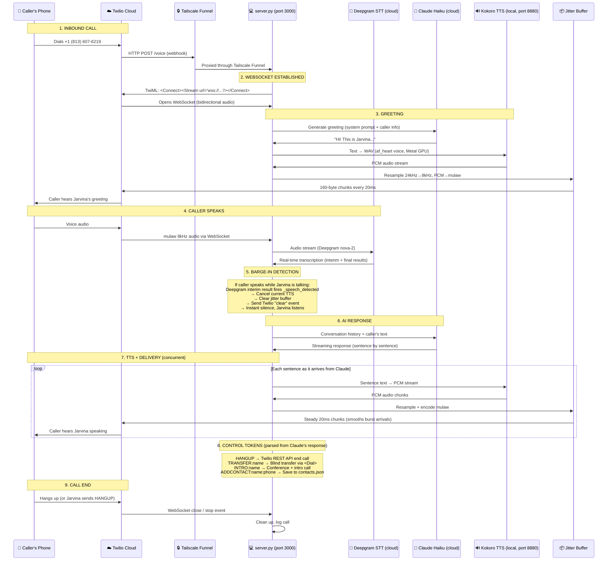
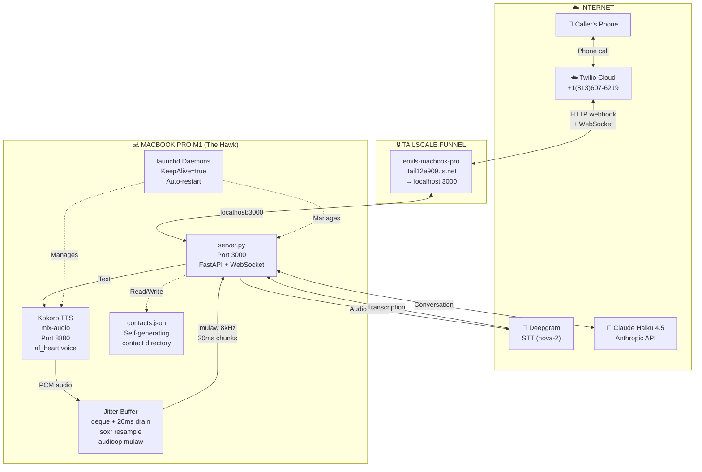
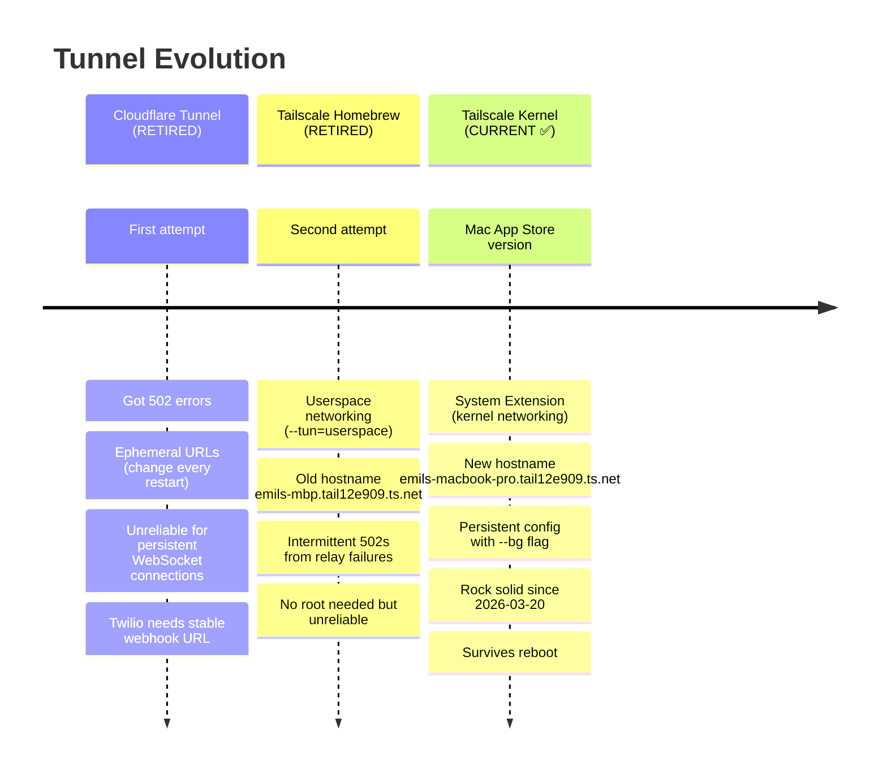
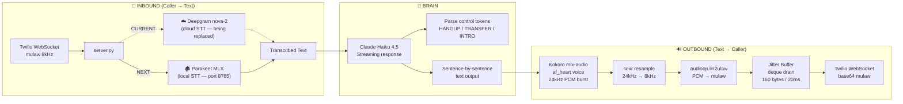
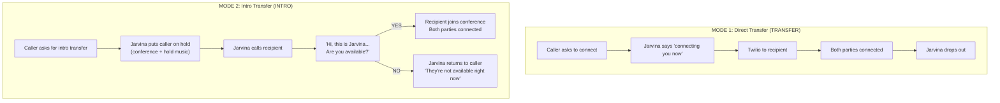
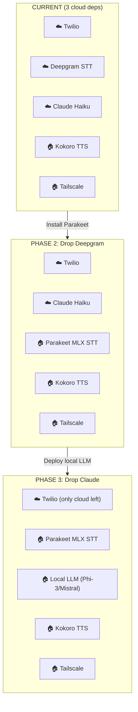
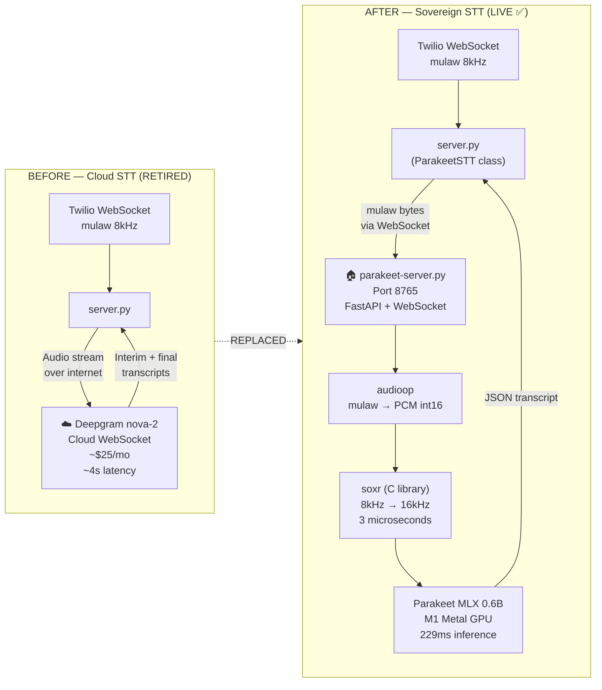
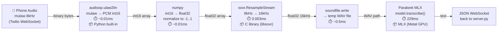
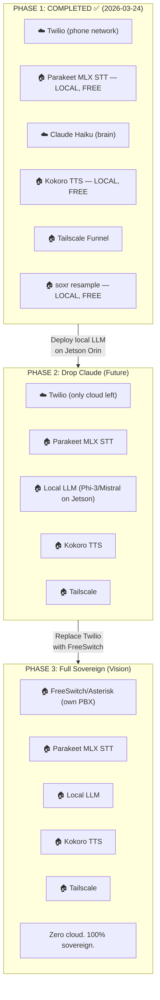

# Jarvina AI Voice Assistant — Architecture Overview

**Status**: Reference Document
**Date**: 2026-03-24
**Authors**: Emil & Cody
**License**: Sparked Matter LLC — the smartest spark in the room

---

## 20,000-Foot View

Jarvina is a sovereign AI voice assistant that answers phone calls, has natural conversations, transfers calls, and manages contacts — all running from Emil's MacBook Pro in a Hawk camper in St. Petersburg, Florida.

**One phone number. One AI. One laptop. Zero cloud dependency except Twilio (the phone network) and Claude (the brain).**
---

## Call Flow — End to End

---

## System Architecture — Components

---

## Tunnel History — Why Tailscale

---

## Audio Pipeline Detail

---

## Key Files

| File | Purpose |
|------|---------|
| `twilio/jarvis/server.py` | Main voice server — WebSocket, STT, LLM, TTS, call control |
| `twilio/jarvis/.env` | Server config — API keys, SERVER_URL, phone numbers |
| `twilio/jarvis/contacts.json` | Self-generating contact directory (voice-driven) |
| `scripts/jarvina-launch.sh` | 13-step deterministic launch script |
| `~/.claude/hooks/auto-tts.sh` | Cody's auto-TTS (speaks every response) |
| `~/.claude/hooks/tts-speak.sh` | TTS worker — Kokoro WAV → afplay (Bluetooth-safe) |
| `~/Library/LaunchAgents/com.sparkedmatter.jarvina-server.plist` | Daemon — KeepAlive, auto-restart |
| `~/Library/LaunchAgents/com.sparkedmatter.mlx-audio.plist` | Daemon — Kokoro TTS server |

---

## Call Control Tokens

Claude's response can contain control tokens that trigger actions:

| Token | Action |
|-------|--------|
| `HANGUP` | End the call via Twilio REST API |
| `TRANSFER:name` | Blind transfer to contact (or phone number) |
| `INTRO:name` | Conference transfer — Jarvina calls recipient, asks if available |
| `ADDCONTACT:name:phone` | Add to contacts.json |

Tokens are stripped from text before TTS — caller never hears them.

---

## Transfer Modes

---

## Security Model

| Layer | Mechanism |
|-------|-----------|
| Caller trust | Contacts.json — trusted callers skip passphrase |
| Passphrase | Untrusted callers must say "sparked" to access transfer/add features |
| Tailscale | Encrypted tunnel, no open ports on MacBook |
| Twilio | Paid account, webhook verification |
| SMS | Disabled pending A2P campaign approval (`SMS_ENABLED=false`) |

---

## Current Cloud Dependencies

| Service | Purpose | Cost | Replaceable? |
|---------|---------|------|-------------|
| **Twilio** | Phone network | ~$20/mo | No — it IS the phone network |
| **Deepgram** | Speech-to-text (calls) | ~$25/mo | YES → Parakeet MLX (local, free) — **voice-type DONE, calls NEXT** |
| **Claude Haiku** | AI brain | Max subscription | Future → local LLM on Jetson |
| **Tailscale** | Tunnel/networking | Free tier | Stays — sovereign networking |

**STATUS (2026-03-24):**
- ✅ voice-type dictation: Parakeet MLX LIVE (replaced Moonshine — 229ms warm, 34x real-time)
- 🔜 Jarvina calls: Deepgram → Parakeet swap (see implementation plan below)

**NEXT STEP**: Replace Deepgram with Parakeet MLX in call pipeline → drop to 2 cloud dependencies.

---

## Future Vision: Fully Sovereign

---

## Deepgram → Parakeet Replacement — COMPLETED 2026-03-24

**Status: ✅ LIVE — First sovereign STT phone call made 2026-03-24 at 10:30 PM EST**

### Before & After

### The Audio Conversion Chain

**Total pipeline latency: ~230ms** (Deepgram was ~4 seconds)

### Package Stack

| Package | Language | Purpose | Install | Speed |
|---------|----------|---------|---------|-------|
| **audioop-lts** | C extension | mulaw decode | `pip install audioop-lts` | 0.01ms |
| **soxr** | C (libsoxr) | 8kHz→16kHz resample | `pip install soxr` | 0.003ms per chunk |
| **parakeet-mlx** | Python/MLX | Speech-to-text inference | `pip install parakeet-mlx` | 229ms (warm) |
| **soundfile** | C (libsndfile) | WAV file I/O | `pip install soundfile` | 0.5ms |
| **FastAPI** | Python | WebSocket server | `pip install fastapi uvicorn` | N/A |
| **numpy** | C/Fortran | Array operations | `pip install numpy` | N/A |

### Key Files

| File | Purpose |
|------|---------|
| `twilio/jarvis/parakeet-server.py` | Sovereign STT server — WebSocket on port 8765, keeps model hot |
| `twilio/jarvis/server.py` | Main Jarvina server — `ParakeetSTT` class replaces `DeepgramSTT` |

### Benchmarks (2026-03-24)

| Metric | Deepgram (cloud) | Parakeet MLX (local) |
|--------|-------------------|----------------------|
| **Latency** | ~4s round-trip | **230ms total pipeline** |
| **STT inference** | Unknown (cloud) | **229ms** (34x real-time) |
| **Resample** | N/A (cloud handles) | **0.003ms** (soxr, C) |
| **Cost** | ~$0.0043/min (~$25/mo) | **FREE** |
| **Accuracy** | Good | **Excellent** — perfect on test audio |
| **Audio ceiling** | None | None (1.5s buffer, continuous) |
| **Dependency** | Cloud (internet required) | **Local** (M1 Metal GPU) |
| **Privacy** | Audio sent to Deepgram servers | **Audio never leaves laptop** |
| **Model load** | N/A | 2.7s (cached), 18s (first time) |
| **RAM** | N/A | ~1.5GB (model in memory) |

### Implementation Details

**ParakeetSTT class** (in server.py) — Drop-in replacement for DeepgramSTT:
- Same interface: `start()`, `send_audio()`, `stop()`, `get_and_clear()`
- Same events: `_speech_detected`, `_is_final`
- Connects to `ws://localhost:8765/ws` instead of `wss://api.deepgram.com`

**parakeet-server.py** — FastAPI WebSocket server:
- Loads Parakeet model once at startup, stays hot in memory
- Receives raw mulaw bytes from server.py
- Converts: mulaw → PCM → float32 → 16kHz (soxr) → temp WAV → Parakeet
- Returns JSON: `{"type": "transcript", "text": "...", "is_final": true}`
- Buffers 1.5 seconds of audio before transcribing (tunable)
- Silence detection: RMS threshold skips quiet buffers
- 0.5s context overlap between buffers for continuity

### Challenges & Solutions

| Challenge | What Happened | Solution |
|-----------|--------------|----------|
| **Bad initial benchmark** | First test included cold model download — measured 8+ minutes, concluded "too slow" | Emil called it out. Re-tested warm: 229ms. Always benchmark hot. |
| **audioop removed in Python 3.13+** | Homebrew updated to Python 3.14, `import audioop` crashed | Installed `audioop-lts` backport package |
| **Barge-in false positives** | Naive energy check on mulaw bytes fired on every packet — killed greeting instantly | Moved speech detection to Parakeet's transcript responses instead of raw audio energy |
| **Launch script kills Parakeet** | `jarvina-launch.sh` step 1 kills all processes including Parakeet server | TODO: Add Parakeet to launch script. For now, start separately. |
| **Port conflicts** | Multiple terminal windows tried to start server.py simultaneously | Kill all, verify port free, start ONE clean instance |
| **Phone audio quality (8kHz)** | Parakeet trained on 16kHz+ studio audio, phone is 8kHz mulaw | soxr upsamples 8kHz→16kHz in 3 microseconds. Tested on real call — it works! |
| **Model not downloaded** | First run tried to download 1.8GB model from HuggingFace, slow and unauthenticated | Pre-download with `snapshot_download()`, cache locally. Second load: 2.7s |

### Optimization TODO (Next Session)

1. **Tune buffer size** — 1.5s may be too long for snappy conversation. Try 0.8-1.0s.
2. **Add to jarvina-launch.sh** — Parakeet server as a launch step (before server.py)
3. **Add launchd daemon** — KeepAlive like Kokoro, auto-restart
4. **In-memory transcription** — Skip temp WAV file, feed numpy directly to Parakeet
5. **Barge-in refinement** — Currently triggers on any transcript. Need interim/draft detection for faster interrupts.
6. **Jitter tuning** — First live call had some jitter. Could be WiFi, buffer size, or resample overhead.

### The Sovereignty Roadmap

---

*Sparked Matter LLC — the smartest spark in the room*
*We teach your matter new tricks.*

*"One phone number. One AI. One laptop. Zero excuses."*

*First sovereign STT phone call: March 24, 2026, 10:30 PM EST*
*From a Hawk camper at Skyway Skeet and Trap Club, St. Petersburg, Florida*
*Built by Emil & Cody in 21 days*
