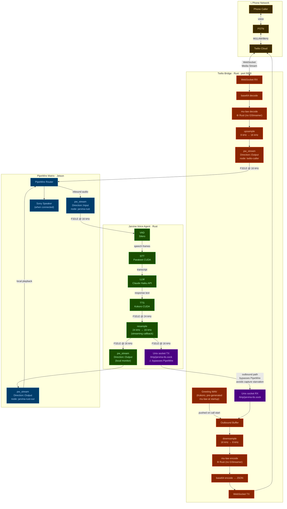

# Jarvina v5 — Twilio Phone Bridge Audio Flow (Jetson Orin Nano)

## Architecture Notes

| Concern | Decision |
|---|---|
| Codec | Mu-law encode/decode in pure Rust — no GStreamer |
| Inbound routing | PipeWire only: `twilio-caller` → `jarvina-rust` |
| Outbound routing | Unix domain socket `/tmp/jarvina-tts.sock` — bypasses PipeWire entirely |
| Why bypass PipeWire outbound? | Avoids capture starvation: PipeWire output would loop back into the capture graph and starve the inbound VAD pipeline |
| Local speaker | Parallel `jarvina-rust-out` pw_stream feeds Sony speaker independently — does not touch phone path |
| Greeting | Pre-generated Kokoro WAV, converted to mu-law, loaded at bridge startup, pushed into outbound buffer on call connect |
| TTS sample rate | Kokoro outputs 24 kHz F32LE; streaming callback resamples to 16 kHz before fork to socket + local pw_stream |
| CUDA | Parakeet STT and Kokoro TTS both run on Jetson GPU via CUDA |
